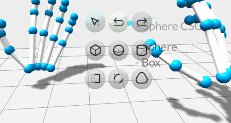
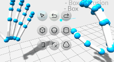
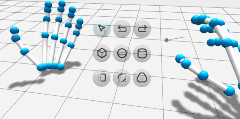
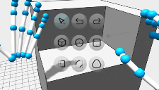
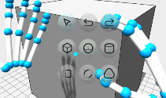
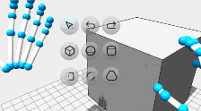

# [LeapShape](https://leapmotion.github.io/LeapShape/)

  
  
  

> **Note**
> Hands only compatible with OpenXR and [Tracking v5.0.0 Releases](https://developer.leapmotion.com/releases#:~:text=TRACKING%20SOFTWARE%20WINDOWS%205.0.0) and older; Enable "Allow Web Apps".

## A Simple and Powerful 3D Modelling Tool

Use simple gestures with your mouse or hands to model 3D shapes in your browser!

    
    
    

    
    
    

## Features
 - Simple Interface for working with Boxes, Spheres, Cylinders, and Extrusions
 - Powerful CSG Operations allow for infinite configurability
 - Modify Objects via Movement, Extrusion, Filleting/Chamfering, and Dilation/Hollowing
 - Snapping and Coordinate Previews for Precision Assembly
 - Model anywhere with first-class Desktop, Mobile, and VR Platform support
 - Export Models as .obj, .stl, .gltf, or .step
 - Clean and Modular ES6 codebase for extreme extensibility
 - **Free and Open Source under the Apache V2 License**

#### Future Features*
 - Draw and Extrude Custom Profiles
 - Easily Install for Offline-use as a Progressive Web App

## Getting Started with Development
Install [Node.js](https://nodejs.org/en/) first, then run `npm install` in the main folder.

For development, [VSCode](https://code.visualstudio.com/) with [Five Server](https://marketplace.visualstudio.com/items?itemName=yandeu.five-server) is recommended.

## Credits

LeapShape is based on several powerful libraries

 - [three.js](https://github.com/mrdoob/three.js/) (3D Rendering Engine)
 - [opencascade.js](https://github.com/donalffons/opencascade.js) (CAD Kernel)
 - [potpack](https://github.com/mapbox/potpack) (UV Atlas Packing)
 - [leapjs](https://github.com/leapmotion/leapjs) (Ultraleap Hand Tracking)
 - [esbuild](https://github.com/evanw/esbuild) (Build System)
